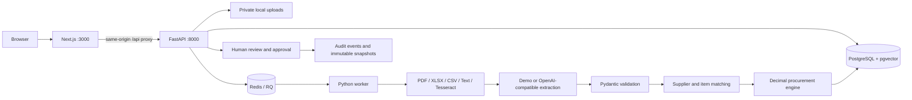

# Accord — AI Procurement Workspace

**Turn supplier quotes into procurement decisions.**

Accord is a local B2B procurement application for comparing supplier quotations, finding price and delivery risks, reviewing source evidence, and recording a human decision. It includes a real Next.js frontend, FastAPI backend, relational database, document pipeline, and deterministic procurement engine.

**Verification status:** the full Docker stack is verified on Windows with Linux containers: Next.js, FastAPI, PostgreSQL/pgvector, Redis/RQ, private bind-mounted files, PDF/XLSX/CSV parsing and Tesseract OCR. Final results: 52 fast backend tests, 15 live Docker integration tests, two Playwright workflows, lint/typecheck/build, fresh PostgreSQL migration/idempotent seed and persistence after a full Compose restart. See [concrete evidence and limitations](docs/verification.md). GPU and local/hosted model inference remain optional and unverified.

## Quick start

Prerequisites: Docker Engine/Desktop with Linux containers and Docker Compose v2. Allow roughly 4 GB of free memory for the application stack. Internet is required once to download public packages and images. Running demo mode requires no cloud credentials, paid services, GPU, or AI server.

From the repository root:

```bash
cp .env.example .env
docker compose up --build
```

PowerShell equivalent:

```powershell
Copy-Item .env.example .env
docker compose up --build
```

Open [http://localhost:3000](http://localhost:3000). API documentation is at [http://localhost:8000/docs](http://localhost:8000/docs).

The API waits for PostgreSQL and Redis, runs Alembic migrations, and seeds the demo before becoming healthy. The frontend and worker wait for the API. Initial image downloads/builds can take several minutes.

For detached startup with readiness confirmation, use `docker compose up -d --build --wait --wait-timeout 90`, then `docker compose ps`. All five services have health checks. Stop native Accord processes on ports 3000/8000 before starting Compose.

| Demo role | Email | Password |
|---|---|---|
| Buyer | `buyer@apex.example` | `Demo2026!accord` |
| Admin | `admin@apex.example` | `Demo2026!accord` |
| Viewer | `viewer@apex.example` | `Demo2026!accord` |
| Isolated tenant viewer | `viewer@isolated.example` | `Demo2026!accord` |

These are intentionally public development credentials. The stack binds published ports to loopback. It is not configured for public production exposure.

## The 60-second demo

1. Sign in as Buyer and open **RFQ-1003 — Industrial Electrical Components**.
2. Compare 5,000 AX-100 relays, 1,000 BX-220 modules, and 2,500 CX-300 switches across four suppliers.
3. See Meridian’s best overall fit, Nova’s faster delivery, Atlas’s price increase, and Vertex’s MOQ and delivery conflicts.
4. Open Meridian’s quote. Inspect a field’s source evidence, correct a price, and save. Comparison totals and ranking recalculate.
5. Confirm review, generate a recommendation, create/edit a negotiation draft, and approve the recommendation.
6. Open **Audit Log** and inspect the approval and field changes.

Seeded RFQ-1003 totals before corrections:

| Supplier | Evaluated total | Lead time | Meaning |
|---|---:|---:|---|
| Atlas Industrial Supply | $127,400 | 36 days | Relay price +14.3% over historical average |
| Meridian Components | $118,980 | 24 days | Best overall fit |
| Nova Supply Group | $120,200 | 18 days | Fastest delivery |
| Vertex Industrial | $119,850 | 60 days | MOQ and delivery conflicts |

Potential savings are **$8,420**, measured against the highest complete comparable quote. This is a sourcing opportunity, not realized savings.

The story is anchored to quotations dated September 9, 2026 and requested delivery October 30, 2026. Expiration and delivery rules use the current date; older demo quotes will eventually require updated dates rather than silently bypassing expiration rules.

## Product screens

- Dashboard: sourcing counts, review workload, savings, alerts, and recent activity.
- Inbox: multiple file upload, drag/drop, pasted supplier emails, visible processing stages, errors and retry, saved email drafts.
- RFQs: search, filters, sorting, pagination, and the supplier comparison workspace.
- Quote review: original document/text, editable metadata and lines, source snippets, confidence, item mapping, and recalculation.
- Suppliers and Items: searchable masters, detail pages, purchasing history, contacts and aliases.
- Purchase History: records and administrator CSV import.
- Audit Log: filters plus original/updated values, actor, and timestamp.
- Settings: organization, scoring weights, anomaly threshold, provider mode, and administrator user creation.

Screenshots produced by the Playwright workflow are saved in `apps/web/test-results/`; selected verified screenshots are in `docs/screenshots/`.

## Architecture



Next.js 16.3 App Router, TypeScript, Tailwind 4 and shadcn/Radix provide the UI. FastAPI, Pydantic 2, SQLAlchemy 2 and Alembic provide the API and schema. PostgreSQL 17 includes pgvector for future semantic matching; embeddings are not required. Redis and RQ run document jobs. Tesseract and Poppler handle image and scanned PDF OCR on CPU.

The frontend only formats monetary values. Financial calculations, matching, scoring, eligibility, authorization, and approval validation run in Python. Provider output cannot execute tools or approve decisions.

## Repository structure

```text
apps/
  api/
    app/                  models, schemas, API routes, engine, matching, providers, worker
    migrations/           frozen Alembic migration and revision template
    tests/                calculation, API, tenancy, document and workflow tests
    tools/evaluate.py     extraction benchmark utility
    Dockerfile
  web/
    src/app/              Next.js App Router and styles
    src/components/       procurement screens and owned shadcn primitives
    src/lib/              typed API data and client helpers
    e2e/                  Playwright decision and upload workflows
    Dockerfile
demo-data/
  quotes/                 PDF, XLSX, CSV, PNG and scanned PDF samples
  ground-truth/           validated extraction fixtures
  imports/                sample purchasing-history CSV
  manifest.json           SHA-256 → ground-truth mapping
data/uploads/             private organization-specific source files (gitignored)
docs/                     architecture, verification and roadmap
docker-compose.yml
docker-compose.gpu.yml
.env.example
```

## Configuration

Copying `.env.example` supplies all required defaults. No secret/API key is required in demo mode.

| Variable | Default / purpose |
|---|---|
| `DATABASE_URL` | PostgreSQL connection for API and worker |
| `POSTGRES_PASSWORD` | Local database password; must agree with `DATABASE_URL` |
| `REDIS_URL` | Set to internal Redis by Compose |
| `LOCAL_STORAGE_PATH` | `/app/data/uploads`, backed by `./data/uploads` |
| `AI_MODE` | `demo`, `local`, or `api` |
| `AI_BASE_URL` | OpenAI-compatible `/v1` endpoint; default host port 11434 |
| `AI_MODEL` | Required for local/API inference; no model assumed |
| `AI_API_KEY` | Optional in local mode; hosted-provider credential when needed |
| `AI_TIMEOUT` | Model HTTP timeout, default 45 seconds |
| `AI_PROVIDER` | Descriptive future provider setting; compatible protocol is used today |
| `STORAGE_PROVIDER` | `local`; other implementations are extension points |
| `OCR_PROVIDER` | `tesseract`; other providers are extension points |
| `PRICE_ANOMALY_THRESHOLD` | Initial seed default, `0.10`; persisted settings control subsequent analysis |
| `SEED_DEMO` | `true`; set false after provisioning a non-demo database |
| `COOKIE_SECURE` | `false` for loopback HTTP; set true when using HTTPS |
| `APP_ENV` | Development label; does not replace security configuration |

Compose sets `REQUIRE_POSTGRES=true` for API/worker and `REQUIRE_REDIS=true` for API readiness. A SQLite `DATABASE_URL` causes Docker startup to fail explicitly. Native development can still use SQLite when that guard is absent.

Server-side Next.js `API_URL` defaults to `http://127.0.0.1:8000` for native development. The Docker build sets it to `http://api:8000`. No API keys are exposed to the browser.

## Demo extraction

`AI_MODE=demo` loads the extraction associated with the uploaded file’s **SHA-256 content hash**. A trusted filename is insufficient. PDFs/XLSX/CSV still go through their real parsers, then the extraction fixture is validated. All subsequent matching, arithmetic, history analysis, alerts, scoring, review, approvals and audit writes use real application code and persisted data.

Use these previously unseeded samples to test uploads:

```text
demo-data/quotes/Upload_Atlas_RFQ1003.pdf
demo-data/quotes/Upload_Meridian_RFQ1003.xlsx
demo-data/quotes/Upload_Nova_RFQ1003.csv
demo-data/quotes/Scanned_Vertex_RFQ1004.png
demo-data/quotes/Scanned_Vertex_RFQ1004.pdf
```

They add revised quotations to existing RFQs. Uploading the same bytes twice returns HTTP 409 and records duplicate detection. Changing a fixture’s contents requires regenerating its ground truth and manifest intentionally.

An unfamiliar document in demo mode becomes **Needs Review**. Its source remains available. A buyer can enter structured quote JSON manually, then use the normal field editor. Alternatively, configure a local model. The app never invents an extraction for an unknown file.

## Local AI and optional RTX 5060

Run Ollama, LM Studio, or another OpenAI-compatible server yourself, then set:

```dotenv
AI_MODE=local
AI_BASE_URL=http://host.docker.internal:11434/v1
AI_MODEL=your-installed-model
AI_API_KEY=
```

Recreate the API and worker after editing `.env`:

```bash
docker compose up -d --force-recreate api worker
```

The model must support structured JSON completion. Extraction timeouts, connection errors, invalid JSON, or GPU/VRAM errors become reviewable failures. Known demo files fall back to their fixture, with fallback usage recorded as the extraction provider and in structured logs. Recommendations and drafts remain deterministic even without a model.

Optional Ollama container with NVIDIA access:

```bash
docker compose -f docker-compose.yml -f docker-compose.gpu.yml up --build
```

Pull a model that you have chosen for the laptop’s available memory using the Ollama CLI, and set `AI_MODEL` to that installed model. No VRAM capacity or model is assumed for the RTX 5060. Only the Ollama service receives GPU resources. PostgreSQL, Redis, frontend, API, worker and OCR do not require CUDA.

The GPU override requires compatible NVIDIA drivers and container support. If unavailable, omit it and use the standard CPU-only application, or run your local model server in its CPU mode. Docker itself cannot silently satisfy an unavailable GPU device reservation; inference failures never take down the procurement application.

## Hosted AI

Set `AI_MODE=api`, `AI_BASE_URL`, `AI_MODEL`, and `AI_API_KEY` for an OpenAI-compatible hosted service. Hosted mode sends document text to that configured service and should be enabled only when appropriate for your supplier data. It is never needed for development or demonstrations. Non-compatible vendor protocols need future adapters.

## Document processing and storage

- Private paths are `./data/uploads/{organization_id}/{generated_id}.{extension}`.
- Allowed extensions, MIME declarations, binary signatures, UTF-8 encoding and 15 MB size limits are checked before queueing.
- PDF parsing uses pypdf, with Tesseract/Poppler OCR fallback for image-only PDFs. PDFs are capped at 50 pages.
- openpyxl reads XLSX without executing formulas/macros; expanded ZIP data is limited to 50 MB and 10,000 rows.
- CSV/TXT use standard Python parsers. Images are pixel-limited and OCR has a timeout.
- RQ exposes processing stages and records failures; retry is available in the document view.
- Files are never placed in public static storage. Downloads and inline previews require the owning organization’s session.
- Source references retain original text, document ID, page, confidence, and optional bounding-box fields. Human changes are recorded separately.

See [procurement rules](docs/architecture.md) for exact financial, scoring, and review conventions.

## Database migrations and seed

```bash
docker compose exec api alembic current
docker compose exec api alembic upgrade head
docker compose exec api alembic check
docker compose exec api python -m app.seed
```

Seeding is idempotent. The dataset includes one populated organization, one empty organization for isolation checks, four users, 50 suppliers, 250 items, 2,000 purchases, five RFQs and 20 quotes. It does not reset existing business data.

PostgreSQL and Redis persist in named volumes. Uploaded files persist in the project data directory. `docker compose down` stops the stack while preserving data. Removing volumes or uploaded files is a separate destructive operation and is not part of normal startup.

Normal restart, preserving records and source files:

```powershell
docker compose down
docker compose up -d --wait --wait-timeout 90
```

**Database reset for disposable demo data only:** this deletes this Compose project's PostgreSQL and Redis volumes, including all decisions, sessions and queued jobs. It leaves the upload bind directory intact. Back up any records you need first.

```powershell
docker compose down --volumes
docker compose up -d --build --wait --wait-timeout 90
```

With `SEED_DEMO=true`, fresh startup recreates the schema and original demo records. Old unreferenced files may remain in `data/uploads`; they are not exposed by the API. To verify a fresh database without resetting the working demo, use `docker compose exec api python -m tools.verify_postgres_lifecycle`. That utility creates and drops only its uniquely named verification database and temporary source directory.

New schema changes should use `alembic revision --autogenerate -m "description"`, review the migration, then apply it. The initial migration is frozen; do not regenerate it against an existing deployment.

## Native development / host diagnostic fallback

The default setup is Docker/PostgreSQL. For frontend/backend work when the Docker daemon is unavailable, the API also supports SQLite. This does **not** replace Redis/RQ/OCR integration verification.

PowerShell, from the root:

```powershell
python -m venv .venv
.\.venv\Scripts\python.exe -m pip install -r apps/api/requirements.lock.txt
Set-Location apps/api
..\..\.venv\Scripts\python.exe -m alembic upgrade head
..\..\.venv\Scripts\python.exe -m app.seed
..\..\.venv\Scripts\python.exe -m uvicorn app.main:app --host 127.0.0.1 --port 8000
```

In a second terminal:

```powershell
Set-Location apps/web
npm.cmd ci
npm.cmd run dev
```

Without `DATABASE_URL`, SQLite uses `data/local.db`. The native API does not automatically load the root `.env` file. Native background processing still requires Redis and an RQ-compatible worker environment; without them, uploads are stored with an actionable queue error and manual entry remains available. Tesseract and `pdftoppm` must be on PATH for native OCR. Production native startup uses `npm run build` then `npm run start`.

## Testing

Backend in Docker:

```bash
docker compose exec api pytest -q
docker compose exec api ruff check .
```

The fast tests isolate SQLite databases and storage. To keep their login attempts out of the live Redis rate-limit counters, run:

```powershell
docker compose exec -T -e REQUIRE_REDIS=false -e REDIS_URL=redis://127.0.0.1:1/0 api pytest -q
docker compose exec -T -e RUN_DOCKER_INTEGRATION=true api pytest integration -q
docker compose exec -T api python -m tools.verify_postgres_lifecycle
```

The opt-in integration suite uses actual HTTP through the web proxy, PostgreSQL, Redis and the worker. Run it only against a demo/test stack: it creates synthetic documents, history imports, drafts, decisions and audit entries. A one-second timeout probe intentionally creates a failed RQ job, verifies the callback, and then retries the document. Expected failure-test logs are explained in [verification.md](docs/verification.md).

Frontend from `apps/web`:

```bash
npm ci
npm run typecheck
npm run lint
npm run build
npx playwright install chromium
npm run test:e2e
```

The critical decision flow runs against a live seeded app. It creates traceable test decisions/drafts and restores the relay price afterward. Run on a demo/test database. The upload test is opt-in because it requires the live Redis worker and adds three revised quotes:

```powershell
$env:E2E_UPLOADS='true'
npm.cmd run test:e2e
```

Or on Linux/macOS: `E2E_UPLOADS=true npm run test:e2e`.

On a freshly seeded database, the upload test verifies three newly enqueued jobs. On subsequent runs it asserts HTTP 409 duplicate rejection and verifies the existing persisted results. The comparison test accommodates revised quotes from those uploads. Fast backend tests use isolated temporary SQLite databases and uploads; the opt-in Docker integration suite intentionally uses the live demo stack.

Extraction evaluation from `apps/api`:

```bash
python tools/evaluate.py ../../demo-data/ground-truth/Atlas_RFQ1003.json ../../demo-data/ground-truth/Atlas_RFQ1003.json
```

Replace the second argument with a model’s extraction output. It reports supplier/quote metadata and SKU/quantity/price/MOQ/lead-time field accuracy.

## Security decisions

- scrypt password hashes; opaque expiring sessions stored as SHA-256 hashes; HTTP-only, SameSite Strict cookies; logout revokes the session.
- Every business query is tenant scoped. Referenced RFQs, items, suppliers and documents are checked before mutations.
- Buyer/Admin can process and review; Viewer is read-only; organization/settings/history import/user creation require Admin.
- State-changing requests require `X-Procurement-Client: workspace`; cross-site origins are rejected. The same-origin Next.js proxy avoids permissive CORS.
- Upload content is data, never instructions. AI has no tool access, SQL authority, purchasing permission, or outbound-email capability.
- Decimal arithmetic and server-side eligibility gates remain authoritative.
- Quote version checks reject lost updates. RFQ revision changes invalidate saved recommendations. Approval rechecks current eligibility and reviewed status.
- API and worker processes drop to a non-root user after preparing the mounted upload directory. Secrets remain outside committed files and browser bundles.

This is a local MVP, not a production security certification. Before external deployment add HTTPS, real account lifecycle/MFA, production secret handling, backups, rate-limit fail-closed behavior, database RLS as defense in depth, malware scanning, and load/concurrency testing. See [architecture and limitations](docs/architecture.md).

## Known limitations and next milestone

The standard Docker/PostgreSQL/Redis/OCR stack has passed verification on this host. Optional local/hosted inference and GPU acceleration have adapters/configuration but have not been benchmarked on this laptop. Fuzzy item matches are suggestions; semantic matching is a future extension. Manual entry uses a structured JSON form. Email drafts are templates. No exchange rates, UOM conversions, split awards, real email sending, purchase orders, ERP integrations, or payments are implemented.

The next milestone is a procurement-user pilot with anonymized real quotations and automated Linux CI for the verified stack. See [roadmap and user-validation questions](docs/roadmap.md).
